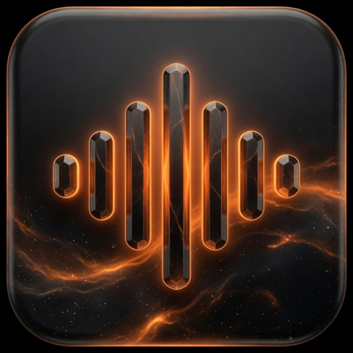
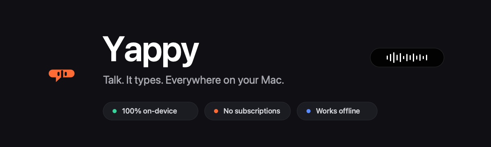
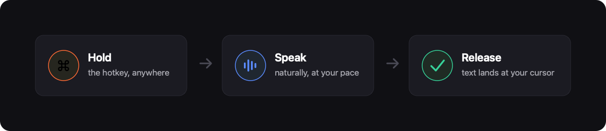
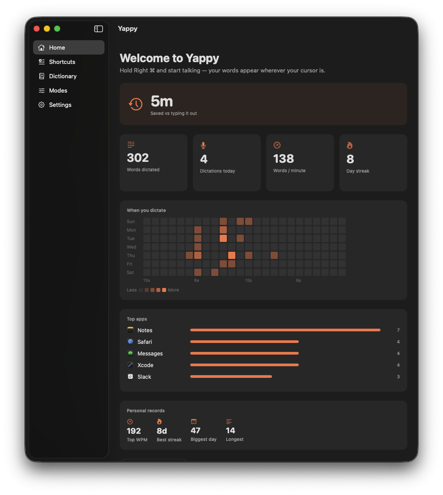
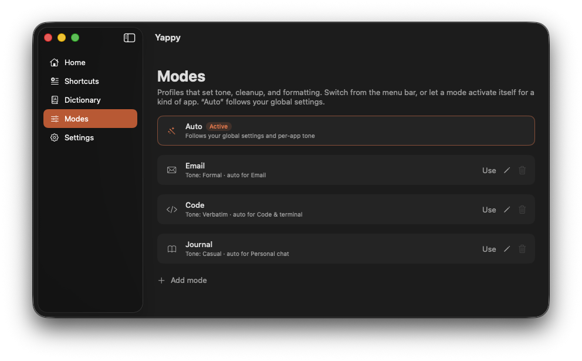
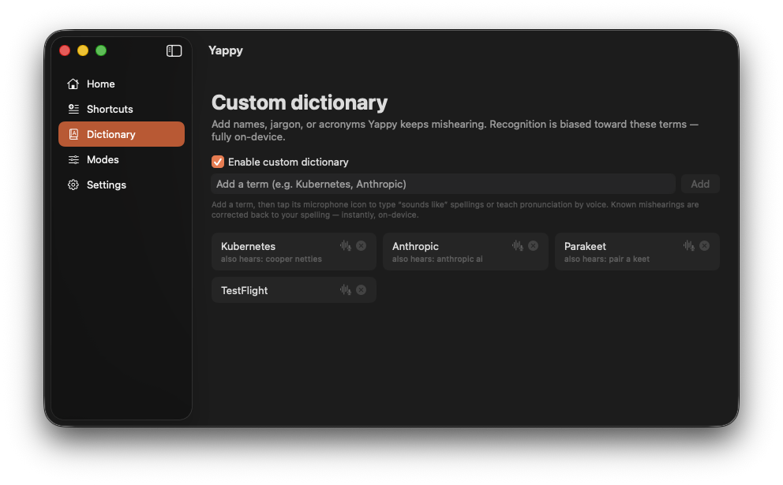
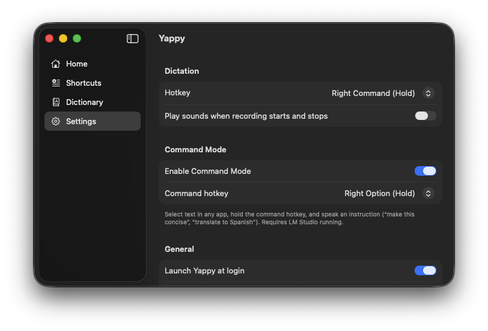
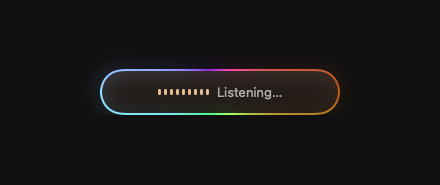
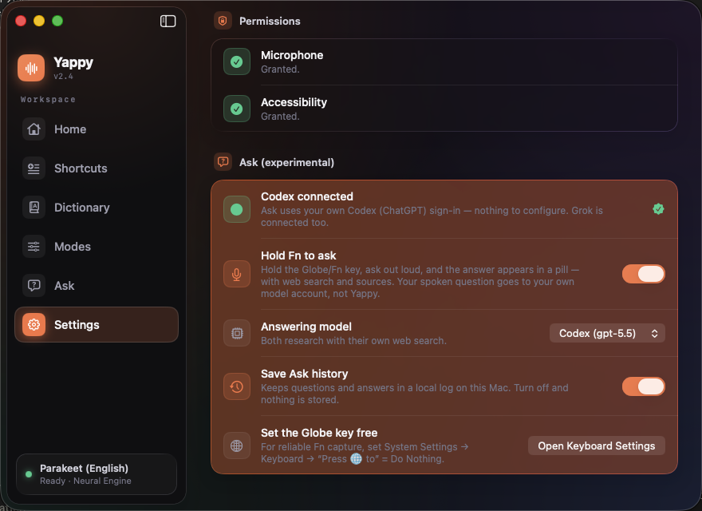
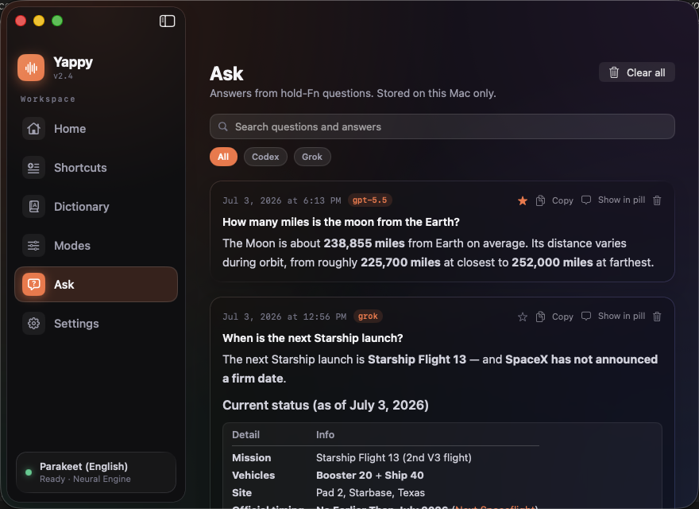

<div align="center">





<h3>Voice-to-text for macOS that runs entirely on your Mac.</h3>

<p>Hold a key, speak, release — your words appear at the cursor in any app, usually in under a second.<br>
No API keys. No cloud for dictation. No subscriptions. Dictation never leaves the device.</p>

<p>And when you want an <i>answer</i> instead of typing: hold <b>Fn</b> and ask. <b>Answers</b> is an optional, off-by-default assistant<br>that researches with web search through <i>your own</i> ChatGPT (Codex) or Grok account. Hold Fn again to follow up,<br>or say <i>"insert that"</i> to drop the answer straight into whatever you're writing.</p>

<p>


</p>

<p><b><a href="https://superluis0.github.io/Yappy/">Website</a></b> &nbsp;&middot;&nbsp; <b><a href="https://github.com/superluis0/Yappy/releases/latest">Download</a></b> &nbsp;&middot;&nbsp; <b><a href="#setup">Setup</a></b></p>

</div>

---

## Why Yappy

Most dictation apps stream your microphone to a server. Yappy doesn't. It runs NVIDIA's **Parakeet** speech model directly on the **Apple Neural Engine** (via [FluidAudio](https://github.com/FluidInference/FluidAudio)) — so transcription is fast, private, and works on a plane with the Wi‑Fi off.

It stays out of your way until you need it: a single global hotkey, a small recording pill that fades in only while you talk, and text that lands wherever your cursor already is — your editor, Slack, the browser, a terminal, anywhere. While you hold the key, a soft glow circles the pill so you always know Yappy is listening — rainbow by default, or a calm white or orange if you prefer.

<div align="center">

</div>

<div align="center">

</div>

## A real app, not just a menu bar blip

Open Yappy and you land on a home that actually tells you something: how much time dictation has saved you, your stats and personal records, a heatmap of *when* you dictate, the apps you use it in most, and your searchable history — all stored locally. The whole interface is a bespoke **Liquid Glass** design — a branded sidebar and translucent glass cards across every screen.

<div align="center">

</div>

Build dictation **modes** for different contexts — and teach Yappy the names and jargon it mishears, either by typing the spellings or training them with your voice so it learns how *it* hears you.

<div align="center">

</div>

<div align="center">

</div>

Everything is configurable in one place — hotkey, sounds, number formatting, numbered lists, filler removal, spoken commands, spoken punctuation, voice editing, voice commands, adaptive per-app modes, optional AI cleanup (with self-correction), and permissions.

<div align="center">

</div>

## Answers — hold Fn, get an answer

Dictation types what you say. **Answers researches what you ask.** Hold the **Fn (Globe)** key, say the question out loud — *"what were the top AI headlines this week?"*, *"compare the M4 chips in a table"* — and release. The same listening glow rings the Answers pill while you speak, and stays on the card while it researches and answers — one glance tells you the mic is live.

<div align="center">

</div>

The answer streams into a floating dark-glass card at the bottom of your screen: live research steps while the model searches the web, then the answer itself, with the domains it cited shown as clickable **source chips** and a badge naming the model that answered. Tables render as real tables, code as code boxes, lists as lists, images load on click — and a wide table widens the card to fit. The card auto-dismisses on its own (longer answers linger longer); **hover to pause it, click to pin it.**

<div align="center">

</div>

It goes further than a one-shot answer:

- **Follow up without touching the keyboard.** With an answer on screen, hold **Fn** again and ask the next thing — the conversation continues on the same thread, the card shows the question chain, and every turn is saved.
- **Land the answer where you're working.** Hit **Insert**, or just say *"insert that"*, and the answer drops in as clean plain text at the cursor of the app you were in (tables become tab-separated). The card never stole your focus, so it goes exactly where you left off. **Copy** and **Ask again** are a click away too.
- **Drive the card by voice.** Whole-utterance commands only, so a real question is never mistaken for one: *"copy that"*, *"insert that"*, *"pin that"*, *"dismiss"*, *"try again"*.
- **Ask for more thinking when it matters.** Prefix a question with *"think harder, …"* and Yappy routes that one question at higher reasoning effort.
- **Hear the answer, hands-free.** Turn on *Read answers aloud* and a **Speak** button appears on the card (or just say *"read that"*); *"stop talking"* stops it. This one is **100% local** — a neural voice runs entirely on your Mac, so the answer text never leaves it. Optional and off by default: it lights up green once the voice engine is installed (`brew install espeak-ng && pip3 install mlx-audio "misaki[en]" && python3 -m spacy download en_core_web_sm`, Apple Silicon), then downloads a small voice model on first use. Pick from eight American and British voices **at the pace you like** — Relaxed, Normal, Brisk, or Quick — or have every answer read automatically. It reads like a person, not a parser: dates, times, temperatures, and abbreviations are spoken the way you'd say them, tables are summarized into sentences instead of recited row by row, and markdown never leaks into the audio.

A few honest facts about how it works:

- **It is the one Yappy feature that sends your question off this Mac — and it's off by default.** Nothing about Answers runs, listens, or connects until you flip it on in Settings.
- **It uses accounts you already have.** No API keys and no Yappy account: if the [Codex CLI](https://github.com/openai/codex) (ChatGPT) or the Grok CLI is installed and signed in on your Mac, Yappy detects it automatically — a green light in Settings and you're done. Your spoken question goes to *your* model account; Yappy has no server in the middle.
- **Only the transcribed question leaves your Mac.** Speech-to-text still happens on-device; the audio itself never goes anywhere.
- **The model can only answer — it can't act.** Answers runs the model read-only: it researches and replies, and any attempt to run a command or control your Mac ends the turn on the spot. Both backends answer under one strict contract: be concise, cite sources, don't narrate.
- **You stay in control of the moment.** Click an answer to pin it (a pin icon unpins); press Esc or the stop button to interrupt mid-answer; ask right after launch and Yappy shows a brief *Getting ready…* while the speech model loads, then starts recording the instant it's set.

<div align="center">

</div>

Pick your answering model — **Codex (gpt-5.5)** or **Grok** (Composer 2.5 Fast or Grok Build) — and switch anytime. Every completed answer lands in a **searchable, local-only history** in the main window: full-text search across questions and answers, filter by backend, star the ones worth keeping (favorites float to the top), and copy, re-show in the pill, or delete any of them — or **Clear all**. *Show Last Answer* in the menu bar re-summons the newest one, pinned.

<div align="center">

</div>

## Features

**Local transcription** — a selectable speech model, running on the Apple Neural Engine via [FluidAudio](https://github.com/FluidInference/FluidAudio). **Parakeet** (English) is the default — Parakeet TDT 0.6B, roughly 120× real-time on Apple Silicon, downloading once (~443 MB). Prefer another language? Switch to **Nemotron 3.5** (multilingual, ~670 MB), which downloads on first use. Either way the model is fetched once and never phones home again; pick yours in **Settings**.

**Universal insertion** — pastes at the cursor in any app, including Electron apps, web views, and terminals where direct insertion fails. Your clipboard is snapshotted and restored, so nothing you copied gets clobbered.

**Numbers written the way you'd type them** — *"three thirty pm"* becomes `3:30 PM`, *"twenty dollars and fifty cents"* becomes `$20.50`, *"twenty twenty six"* becomes `2026`, *"twenty third"* becomes `23rd`, *"version eleven point six point zero"* becomes `11.6.0`. All local and deterministic — no LLM involved — and deliberately conservative, so *"wait a second"* and *"one in a million"* stay exactly as you said them.

**Spoken lists** — count off items and Yappy formats them: *"one milk two eggs three bread"* becomes a clean numbered list. Conservative by design — it only kicks in for a real run that starts at one, so a stray count inside a sentence stays put.

**Clean transcripts** — standalone fillers (*"um"*, *"uh"*) are stripped and the punctuation around them healed; say *"new line"* or *"new paragraph"* to insert real line breaks while you dictate. Both are toggles, and low-confidence noise decodes are discarded instead of inserted as garbage.

**Spoken punctuation** — dictate the marks you want: *"comma"*, *"period"*, *"question mark"*, *"open paren … close paren."* It matches whole words only, so plurals and embedded words are safe — and it's a toggle if you'd rather say those words literally.

**Backtrack** — change your mind mid-sentence and Yappy keeps the correction: *"let's meet at 2, actually 3"* lands as *"Let's meet at 3."* Part of the optional AI cleanup, so it rides along with whatever else cleanup is doing.

**On-device AI cleanup** — polish transcripts with a fix-up pass for punctuation, capitalization, and filler. It runs entirely on-device with **Apple Intelligence** (macOS 26+) and is **on by default**; where Apple Intelligence isn't available it degrades to the raw transcript. The same engine powers backtrack. A battery of output guards keeps it honest: a dictated question is *typed*, never answered; invented content is rejected in favor of your raw words; and spoken numbers render the way a typist would (*"two point four"* → `2.4`, *"three thirty pm"* → `3:30 PM`). Multi-line dictations are cleaned in a single validated pass, so long dictations stay fast.

**See what the AI changed — and take it back** — every dictation keeps the pre-cleanup transcript. Reveal or copy *"what you said"* from History, or say **"use what I said"** and Yappy swaps the raw words back in place. Trust the cleanup because you can always see past it.

**Automatic updates** — Yappy keeps itself current via [Sparkle](https://sparkle-project.org), with EdDSA-signed releases verified before they're applied. No surprise dialogs: when a new version is ready a calm banner slides in over the window, an *Update to Yappy …* item appears at the top of the menu bar, and a dot marks the menu-bar icon — install on your own schedule with one click. After an update, a short *What's New* card recaps what changed. Check manually any time from the menu bar or **Settings → Software Update**.

**Voice editing** — fix what you just said, hands-free: *"scratch that"* undoes the last insertion, *"delete the last word"* trims it, *"all caps that"* / *"capitalize that"* recases it, *"use what I said"* reverts the AI cleanup. It only fires on a whole-utterance command (so *"scratch that idea"* stays prose) and won't delete the wrong thing if your cursor has moved on.

**Voice commands** — drive the app by voice, spoken as their own utterance: *"switch to email mode"*, *"open scratchpad"*, *"new note."* Exact-match only (like voice editing), so a real dictation is never swallowed. A toggle.

**Dictation modes** — named profiles (Email, Code, Journal…) that bundle tone, AI-cleanup, formatting, and an extra vocabulary. Switch from the menu bar, or let a mode activate itself automatically for a kind of app. The built-in *Auto* mode follows your global settings — and, optionally, **learns**: it remembers the mode you last picked in each app and reapplies it there (an explicit pick still wins everywhere until you switch back to Auto).

**Voice shortcuts** — say a cue and Yappy expands it to canned text: an email signature, a calendar link, a block of boilerplate.

**Smart suggestions** — Yappy notices phrases you dictate over and over and offers, right on the home screen, to turn them into a shortcut — one click to add, or dismiss. Drawn entirely from your local history.

**Scratchpad** — a floating notepad a keystroke away (**⌥⇧S**), always on top like a sticky note. Jot or dictate into it without leaving whatever app you're in; notes are kept locally with a simple sidebar, and sync nowhere.

**Context-aware tone** — cleanup adapts to the app you're typing in, with tones that do exactly what they say: **Formal** expands contractions and guarantees full sentences, **Casual** drops the trailing period on short messages, and **Verbatim** skips cleanup entirely so nothing in a code editor gets reworded. Deterministic transforms, not AI improvisation — validated so they never change your meaning. Dictating into a one-line field (a search box, a URL bar)? Yappy notices and lands your words as one clean line.

**Custom dictionary** — teach Yappy your names, jargon, and acronyms. It comes pre-loaded with common developer and tool names — Supabase, Vercel, Cloudflare, Kubernetes, and more — so they transcribe right the first time. Add your own by typing the spellings it tends to mishear, or **train them by voice** — say a word a few times and Yappy learns how *it* hears you, then corrects those mishearings back to your spelling automatically. Deterministic and fully on-device; recordings are analyzed in memory and never saved.

**Boost your terms in the speech model** — one toggle makes recognition *itself* prefer your dictionary while you dictate (Parakeet/English; a one-time ~98 MB helper model). Not find-and-replace after the fact — the recognizer is steered toward your vocabulary as it decodes.

**Learns from your corrections** — say *"scratch that"*, re-dictate the word you meant, and Yappy notices the difference and offers to remember it — a one-tap suggestion card in Dictionary, never applied silently. The more you correct it, the better it hears you, entirely on-device.

**Activity at a glance** — a "time saved versus typing" headline, words-per-minute, streaks and personal records, a day-by-hour heatmap of when you dictate, the apps you use it in most, and a shareable *"Year in Voice"* recap.

**Polished hotkeys** — hold Right ⌘, double-tap Right ⌘, hold Right ⌥, or hold Right ⌃ for dictation; hold **Fn** for Answers (when enabled). A debounced state machine ignores key repeats and accidental taps, so it never fires when you don't mean it. Press **Esc** to cancel while recording — or while Yappy is still transcribing, to stop the text *before* it lands.

**Considered details** — a molten-glass recording pill whose glow breathes with your voice and shifts into a quiet *Polishing* state while AI cleanup runs, a **listening glow** that slowly circles the pill while the key is held (rainbow, white, or orange — pick in Settings, and it carries through to the Answers card), a menu bar icon that animates while recording, and subtle custom start/stop/done sounds — including a distinct cue when something goes wrong, so failure never sounds like success.

**Private by design** — audio is transcribed on-device and your voice is never recorded to a file; no telemetry, no account. After the speech model download, dictation runs fully offline — nothing you dictate leaves your Mac. The network is also used for Sparkle update checks and update downloads, optional voice/speech model downloads, and the opt-in **Answers** feature (off by default), which sends your transcribed question (never the audio) to the model account you connect, and runs that model read-only — it can research and answer, but a tool or command event kills the turn. A privacy panel on the home screen reflects this state at a glance.

## Setup

**Dictation works after Step 1 — about two minutes.** Steps 2–4 are optional; turn them on whenever you want them.

| To use… | You'll need |
|---|---|
| **Dictation** (required) | Install the app, grant Microphone + Accessibility |
| **Answers** (hold Fn to ask) | The Codex or Grok CLI, signed in |
| **Read answers aloud** | One setup command (Homebrew + pip) |
| **AI cleanup** | Apple Intelligence turned on (macOS 26+) |

### 1. Install Yappy (required)

macOS 14 or newer, on an Apple Silicon Mac (M1 or later).

1. Download **`Yappy.dmg`** from the [**Releases**](https://github.com/superluis0/Yappy/releases/latest) page, open it, and drag **Yappy** into your **Applications** folder.
2. Launch it. Yappy is Apple-notarized, so it opens cleanly — no "unidentified developer" warning and no terminal workarounds.
3. A short first-run flow asks for the only two permissions Yappy needs:
   - **Microphone** — to hear you.
   - **Accessibility** — to detect the hotkey and paste text at your cursor.
4. Hold **Right ⌘**, say a sentence, and release. On first use Yappy downloads its speech model once (~443 MB); after that, dictation runs fully offline.

**That's a complete, private dictation app.** Everything below is optional.

### 2. Answers — ask questions by voice (optional)

Hold **Fn** and ask out loud; the answer streams into a card at the bottom of your screen. It runs on *your own* AI account — no API keys, nothing for Yappy to bill.

1. **Free the Globe key** so Fn is reliable: System Settings → Keyboard → **Press 🌐 to** → **Do Nothing**. (Yappy's Settings has a button that opens this for you.)
2. **Install a backend and sign in** — the [**Codex CLI**](https://github.com/openai/codex) (your ChatGPT account) or the **Grok CLI** (your grok.com account). Both run on [Node.js](https://nodejs.org); install per their instructions, then sign in once from a terminal.
3. Open **Settings → Answers**. Yappy detects the signed-in CLI automatically — a green light means you're set. Pick your model, then hold **Fn** and ask.

### 3. Read answers aloud (optional)

Give Answers a voice that reads replies out loud. This one is **100% on-device**: the answer text never leaves your Mac.

1. Install the voice engine with one command (needs [Homebrew](https://brew.sh)):
   ```bash
   brew install espeak-ng && pip3 install mlx-audio "misaki[en]" && python3 -m spacy download en_core_web_sm
   ```
2. In **Settings → Answers**, turn on **Read answers aloud**. It lights up green, then downloads a small voice model (~336 MB) on first use.
3. Pick from eight American and British voices — tap play to preview one — or have every answer read automatically.

> Yappy uses your Homebrew Python for the voice engine. If the green light doesn't appear after installing, your `pip3` likely installed into a different Python; re-run the command with Homebrew's `python3 -m pip …`.

### 4. On-device AI cleanup (optional, on by default)

Tidies filler, punctuation, and capitalization as you dictate — fully on-device, with **nothing to install**. It just needs **Apple Intelligence** (macOS 26+ on a supported Mac): turn it on in System Settings and Yappy uses it automatically. Where it isn't available, Yappy inserts your raw words and nothing breaks.

## Build from source

Prefer to build it yourself? Requires Xcode 15+ and macOS 14+.

```bash
git clone https://github.com/superluis0/Yappy.git
cd Yappy
open Yappy.xcodeproj
```

Then press **Run** (⌘R) in Xcode — dependencies (FluidAudio) resolve automatically via Swift Package Manager on the first build.

> **Tip:** if another FluidAudio app (such as VoiceInk) has already downloaded Parakeet, Yappy reuses it from `~/Library/Application Support/FluidAudio/Models/` — no second download.

> **Maintainer shortcut:** `Scripts/rebuild-install.sh` rebuilds the Release app, verifies it's signed with the same Apple Developer ID as public releases (so Microphone/Accessibility grants survive across dev builds **and** Sparkle updates), and installs + relaunches it — refusing to install if the signature is wrong. Use `--test` to gate on the unit suite first, or `--build-only` to just verify a build. This requires the maintainer's Developer ID certificate.

> **Cutting a public release:** `Scripts/release-dmg.sh` builds a Developer ID–signed, notarized, stapled `Yappy.dmg` into `dist/` (the download that opens with no Gatekeeper warnings), and with `--publish <tag>` uploads it to a GitHub Release. Needs a one-time `notarytool` keychain profile — run `Scripts/release-dmg.sh --help` for setup. Maintainer-only.

## Privacy

Yappy's two capabilities have different privacy stories, and we'd rather you know exactly which is which:

**Dictation — 100% on-device, always.**

- Audio is transcribed on-device and held only in memory — the recording itself is never written to disk.
- Your dictation history, shortcuts, and custom dictionary are stored locally under `~/Library/Application Support/Yappy/`, written with owner-only file permissions. Clear your history anytime from the home window or Settings.
- History is under your control: turn it off entirely, or set a retention window (7/30/90 days) and older entries prune themselves. Nothing is ever recorded while a password field (secure input) is focused.
- No telemetry, no analytics, no account.
- Speech models download as needed (from Hugging Face or a hosted release). Sparkle checks for app updates over HTTPS and downloads them when you accept one. After models are local, dictation runs fully offline.

**Answers — opt-in, and only your question travels.**

- Off by default. Until you enable it in Settings, the only network traffic is model downloads and Sparkle update checks and downloads.
- When you use it, your spoken question is transcribed **on-device** first; only the resulting text is sent — to the Codex (ChatGPT) or Grok account *you* signed into, using the CLI already on your Mac. The audio never leaves.
- Yappy operates no server and stores no keys: it talks to your locally installed, locally authenticated CLI, the same one you use in a terminal. Web searches the model performs happen under your account, per that provider's privacy policy.
- The connected model is run **read-only** — it answers, it can't act. Any tool or command event during a turn ends that turn, enforced at runtime.
- *Save answer history* is its own toggle. When it's on, answers are saved to a local answer history under the same folder and permissions as everything else — browse, delete individually, or clear it all anytime. Logs never contain your question text, and answer images load only when you click them.

## Architecture

| Area | Files | Role |
|------|-------|------|
| Transcription | `Services/ParakeetTranscriptionService.swift` | Loads & pre-warms the selected model (Parakeet or Nemotron); batch transcription on release |
| Audio capture | `App/AudioRecorder.swift` | AVAudioEngine → in-memory 16 kHz mono Float32 |
| Hotkeys | `Services/HotkeyManager.swift` | One CGEvent tap + a pure, unit-tested state machine |
| Text insertion | `Services/TextInserter.swift` | Cmd+V paste with change-count-safe clipboard restore |
| AI cleanup | `Services/CleanupCoordinator.swift`, `FoundationModelsCleanupProvider.swift` | Routes cleanup and backtrack to on-device Apple Intelligence; graceful fallback |
| Transcript formatting | `Services/TranscriptPipeline.swift` + `Spoken*Formatter.swift` | Fillers, numbers, lists, line breaks, punctuation — deterministic, on-device |
| Custom dictionary | `Core/DictionaryStore.swift`, `Core/BuiltInDictionary.swift` | Built-in dev terms + learned aliases corrected back to canonical spelling |
| Scratchpad | `UI/ScratchpadController.swift`, `Core/NotesStore.swift` | Floating notepad (⌥⇧S) with local note storage |
| Answers (optional) | `Services/AskController.swift`, `CodexAskClient.swift`, `GrokAskClient.swift` | Fn-key voice questions via your own Codex/Grok CLI; block-rendered answers, local history |
| Pill & windows | `UI/` | Floating pill, Answers card, home window, settings, onboarding |

## Tests

```bash
xcodebuild -project Yappy.xcodeproj -scheme Yappy test
```

Over 800 tests cover the hotkey state machine, settings persistence and migration, the transcript pipeline (numbers, lists, spoken punctuation, cross-stage interactions), the AI-cleanup accept/reject guard policy (never answer, never invent, never drop), deterministic tone transforms, the custom dictionary with speech-model term boosting and correction mining, the notes store, history-based shortcut suggestions, voice-command parsing, adaptive per-app mode resolution, dictation history and stats, voice-shortcut expansion, app-context classification, and the Answers stack (run state machine, Fn-hold state machine, controller orchestration driven through injected fakes — follow-ups, insert-at-cursor, and card voice commands, Codex/Grok wire-format parsers, block markdown rendering, and answer history persistence).

## Built with

- [FluidAudio](https://github.com/FluidInference/FluidAudio) — Parakeet, CoreML, and the Apple Neural Engine inference stack.

## License

MIT — see [LICENSE](LICENSE).
